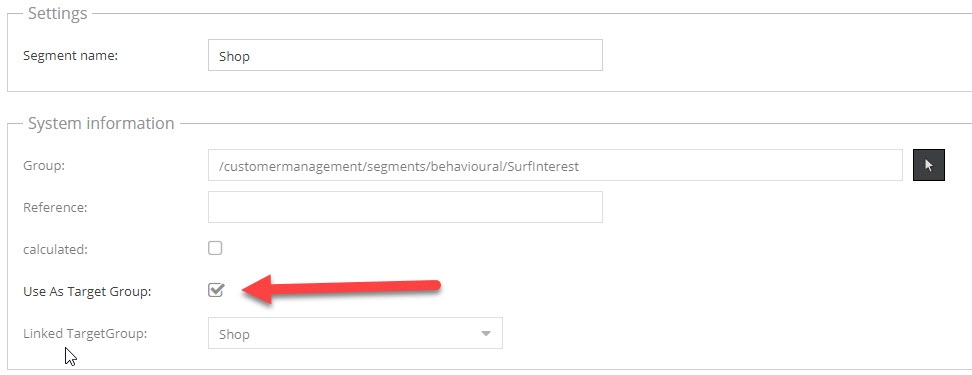
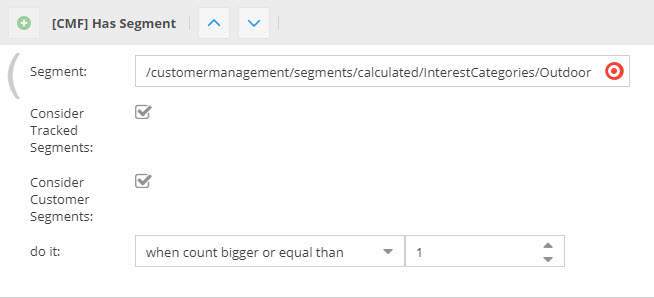
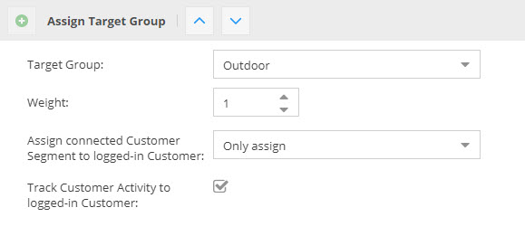

# Integration with Pimcore Personalization

The CMF is tightly integrated into the Pimcore personalization feature and connects the personalization for anonymous 
users with the known users managed in CMF. This is provided by: 
* Connection between Customer Segments and Pimcore Target Groups
* Adding additional conditions and actions to Pimcore Global Targeting Rules
* Special triggers, conditions and actions for Targeting in CMF Action Trigger Service 

## Pimcore Target Groups and Customer Segments 

In Pimcore there is the concept of Target Groups. Target groups are assigned to users based on their behavior only and 
are not stored anywhere. Thus target groups sum up users with similar behaviour and are the entity to personalize 
content in Pimcore documents for. Normally there is just a hand full of target groups since for each target group content
needs to be provided. 

The CMF introduces the concept of Segments. Segments describe a certain characteristic of an user (like age group, premium 
customer, located in France, skier, biker, etc.) and are more specific and more fine grained than target groups. They can 
be assigned to users based on various different reasons (like behaviour, customer data, manually, external data sources), 
are stored in the user profile und used to filter and segment users.
 
Thus a target group can correlate with a segment or can be a summary of multiple segments. But there will also be segments 
that are not connected to target groups at all.  

There are use cases where it makes sense to directly connect segments and target groups with each other. To do so, activate 
the checkbox `Use As Target Group` in segment objects. When doing so, an target group with the same name is automatically 
created and linked to this segment. 

See following sections to see how assignment of target groups based on segments and vice versa can be configured.

> In a nutshell: Target groups sum up similar users on a generic level. To personalize Pimcore document content, use target groups.      
> Segments are used to store specific characteristics of an user in its user profile and can, but don't need to, be connected
> to target groups.

## Additional Conditions and Actions to Pimcore Global Targeting Rules

The CMF adds following conditions and action to the Pimcore Global Targeting Rules:

### Condition `[CMF] Has Segment`
This condition checks if the current user has the given segment assigned. There are two data sources supported: 
1) Targeting storage with tracked segments (see also Action `[CMF] Track Segment`). 
2) User profile with assigned segments. 

To consider these data sources use the checkboxes `Consider Tracked Segments` and `Consider Customer Segments` in the 
configuration. 
The `Has Segment` condition also checks for a certain count of segment assignments of the given segment.    

### Condition `[CMF] Customer Logged-In`
This condition checks if currently a user is logged in. There are no further config options to this condition.

### Action `Assign Target Group`
The CMF extends the default `Assign Target Group` action with following options: 

- `Assign connected Customer Segment to logged-in Customer`: If a user is logged-in, the action checks if there is 
  a segment object connected to the given target group. If so, it assigns it to the customer object.
- `Track Customer Activity tro logged-in Customer`; If a user is logged-in, the action tracks an activity to the customer 
  object. This action can then used for further processing later on.     

### Action `[CMF] Track Segment`
The `Track Segment` action stores the given segment to the Targeting Storage of the current user. This information can 
be used later on, e.g. with the `Has Segment` condition. 

## Special Triggers, Conditions and Actions in CMF Action Trigger Service
In addition to the Pimcore Global Targeting Rules there are also additional triggers, conditions and actions for integration
of Targeting with the CMF Action Trigger Service. 

## Trigger `[Targeting] Segment Tracked`
This trigger fires every time a segment is tracked to the Targeting Store - for example by a Global Targeting Rule or 
when a document with an [assigned segment](./12_SegmentAssignment.md) is opened by an user. There are not further configuration
options, it only stores the segment for later use in conditions and actions.  

## Trigger `[Targeting] Assigned Target Group`
This trigger is fired every time a target group is assigned to the current user - either by a Global Targeting Rule or
when a document with an assigned target group is opened by an user. 

This trigger can be used to modify customer objects (e.g. assigning segments, changing values or tracking segments) when 
a target group is assigned.  

## Condition `[Targeting] Tracked Segments Count`
This condition can check how often the tracked segment is tracked in the Targeting Storage. It always uses the segment 
stored by the `Segment Tracked` trigger. 

Optionally the condition can be restricted to certain segments by adding segments to the list. 

## Condition `[Targeting] Check Weight of Assigned Target Group`
This condition can check how often the target group is assigned to the current user in the Targeting Storage (weight). 
It always uses the target group stored by the `Assigned Target Group` trigger. 

Optionally the condition can be restricted to certain target groups by selecting them in the list. 

## Action `[Targeting] Add tracked segment`
This action adds the tracked segment (stored by the `Segment Tracked` trigger) to the customer object. It can be configured
if other segments from the same group should be removed and if the segment application counter should be increased. 

## Action `[Targeting] Add Target Group Segment`
If there is a segment assigned to the current target group (stored by the `Assigned Target Group` trigger), this action adds  
it to the customer object. It can be configured if other segments from the same group should be removed and if the 
segment application counter should be increased. 

