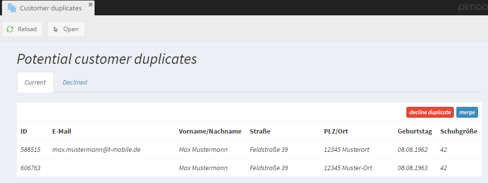

# Customer Duplicates Service

The customer duplicates service consists of 2 major parts:

## Part 1 - mechanisms for searching duplicates of a given customer: 
This is done directly via the database/customer object list. The duplicate service will find customers where the configured fields are equal to the given customer. Simple strtolower/trim transformations are done here so that the comparisons are case insensitive.

The field combination(s) which should match could be defined in the CMF config file (CustomerDuplicatesService->duplicateCheckFields section). (Optional) multiple field combinations are supported (for example first check for duplicates based on firstname/lastname/street/zip/city - if no duplicates where found, check for firstname/street/zip/city/birthDate).

### Samples (for part 1):

#### create a new customer instance
```php
$customer = new Customer();
$customer->setBirthDate(new Date('1982-12-07'));
$customer->setFirstname("Markus");
$customer->setLastname("Moser");
$customer->setZip("5020");
$customer->setPublished(true);
$customer->setActive(true);
```

#### get an object list with duplicates for the new customer instance (set limit to 1)
```php
$duplicates = Factory::getInstance()->getCustomerDuplicatesService()->getDuplicatesOfCustomer($customer, 1);
```

#### if duplicates exist and "checkForDuplicates" is activated in the CMF config file, an exception will be thrown when trying to save the new customer and a duplicate exists.
```php
try {
    $customer->save();
} catch(DuplicateCustomerException $e) {
    print "save failed - duplicate found: " . $e->getDuplicateCustomer() . PHP_EOL;
}
```

#### get duplicates of an existing customer
```php
$existingCustomer = Customer::getById(12345);
$duplicates = Factory::getInstance()->getCustomerDuplicatesService()->getDuplicatesOfCustomer($existingCustomer, 1);
```


## Part 2 - Duplicates Index
The duplicates index is used for searching globally for (fuzzy matching) duplicates. The found duplicates will be visible in the customer duplicates view and the user has the possibility to merge these duplicates manually.

 

 In order to make a performant search for duplicates possible the data is stored in a special format in the duplicate index. By default this is done via several MariaDB-Tables. But it would be possible to for example create a DuplicateIndex for ElasticSearch by implementing the DuplicateIndexInterface.
 
### example config

```yaml
pimcore_customer_management_framework:
duplicates_index:
    enableDuplicatesIndex: true

    duplicateCheckFields:
      - firstname:
          soundex: true
          metaphone: true
          similarity: \CustomerManagementFrameworkBundle\DataSimilarityMatcher\SimilarText

        zip:
          similarity: \CustomerManagementFrameworkBundle\DataSimilarityMatcher\Zip

        street:
          soundex: true
          metaphone: true
          similarity: \CustomerManagementFrameworkBundle\DataSimilarityMatcher\SimilarText

        birthDate:
          similarity: \CustomerManagementFrameworkBundle\DataSimilarityMatcher\BirthDate::class

      - lastname:
          soundex: true
          metaphone: true
          similarity: \CustomerManagementFrameworkBundle\DataSimilarityMatcher\SimilarText

        firstname:
          soundex: true
          metaphone: true
          similarity: \CustomerManagementFrameworkBundle\DataSimilarityMatcher\SimilarText

        zip:
          similarity: \CustomerManagementFrameworkBundle\DataSimilarityMatcher\Zip

        city:
          soundex: true
          metaphone: true
          similarity: \CustomerManagementFrameworkBundle\DataSimilarityMatcher\SimilarText

        street:
          soundex: true
          metaphone: true
          similarity: \CustomerManagementFrameworkBundle\DataSimilarityMatcher\SimilarText


      - email:
          metaphone: true
          similarity: \CustomerManagementFrameworkBundle\DataSimilarityMatcher\SimilarText
          similarityTreshold: 90

    dataTransformers:
      street: \CustomerManagementFrameworkBundle\DataTransformer\DuplicateIndex\Street
      firstname: \CustomerManagementFrameworkBundle\DataTransformer\DuplicateIndex\Simplify
      city: \CustomerManagementFrameworkBundle\DataTransformer\DuplicateIndex\Simplify
      lastname: \CustomerManagementFrameworkBundle\DataTransformer\DuplicateIndex\Simplify
      birthDate: \CustomerManagementFrameworkBundle\DataTransformer\DuplicateIndex\Date
```

In the CMF config the data/logic how duplicates should be stored in the index is defined like in the example above. It's possible to define the field combinations which should match within the DuplicatesIndex->duplicateCheckFields section.

For each field in these field combination it's possible to define how it should be indexed with the following 4 options:
##### soundex
If set to true the field should be relevant for soundex matching. This should be enabled for text fields where a soundex matching could make sense. For example for a zip field it's not really usefull whereas for "firstname" it would be a good idea to enable it :-).

##### metaphone
Same like soundex but another phonetic algorithmn (metaphone). It's possible to combine soundex + metaphone but sometimes it could be useless and a waste of resources to enable both. If you are not sure just enable both. 
  
##### similarity
Searching duplicates by soundex/metaphone will produce a lot of false positive matches. Especially if there are fields like zip where soundex + metaphone should be disabled a mechanism for excluding these false positives is needed. But also the soundex/metaphone algorithmn itself will produce many false positives. In the similarity field it's possible to configure a so called SimilarityMatcher (DataSimiliarityMatcherInterface). All potentially found duplicates by soundex/metaphone search will be compared by these SimilarityMatchers. Only if all fields are similar according to the SimilarityMatchers the found duplicate will be handled as "real" duplicate otherwise it's a false positive.

##### treshold
Each SimilarityMatcher has a default treshold - but it's possbile to (optionally) define a custom treshold which will be handed over to the SimilarityMatcher.

### console command

```
php pimcore/cli/console.php cmf:duplicates-index
```

#### options:

-c - calculate potential duplicates. This needs to run as cron job for example once a day.

-a - analyse false positives. If set false positives will be logged (by default in the plugin_cmf_duplicates_false_positives table).

-r - reacreate index. Recreate the total index for all customers.
