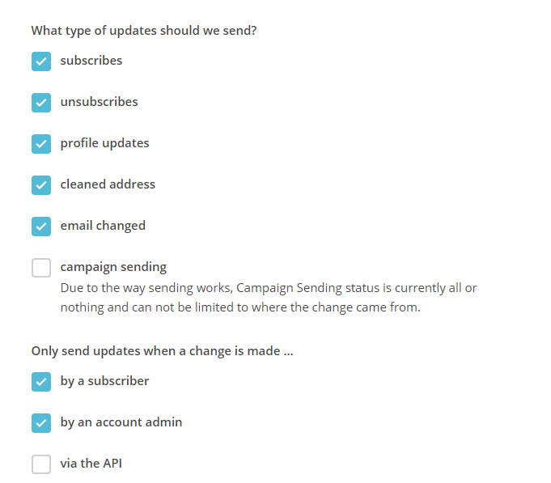
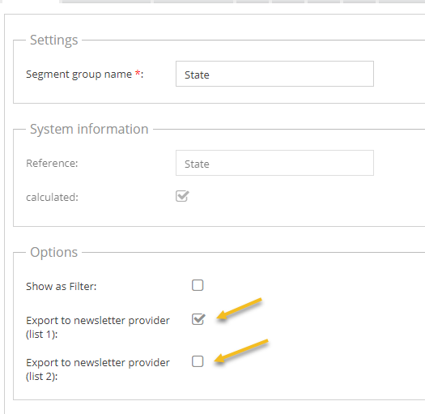

# MailChimp/Newsletter Sync

The CMF offers built-in support for synchronizing customer data with Mailchimp. 

> Other newsletter systems could be integrated too by implementing the ´NewsletterProviderHandlerInterface´.

## Configuration

The CMF can handle multiple Mailchimp lists. Each list is one separate symfony service tagged with `cmf.newsletter_provider_handler`. 

See [Configuration](Configuration.md) for an example configuration of such a service and for a list of general newsletter related settings.

## Prepare data objects for Mailchimp sync

### Customer

It's needed to add a `newslettStatus` and `mailchimpStatus` field into the customer class (for each Mailchimp list):  

The fields need to be named with the shortcut of the associated provider handler as a suffix (e.g. `newsletterStatusList1` and `mailchimpStatusList1`). 

The newsletter status is a project-specific setting. A mapping between the status options and the mailchimp status options need to be done in the service definition of the provider handler.

The mailchimp status needs to be a read only field with the following options:
- subscribed
- unsubscribed
- pending
- cleaned

### CustomerSegmentGroup
Add a checkbox called `exportNewsletterProvider{PROVIDER_HANDLER_SHORTCUT}` for each list to the CustomerSegmentGroup class. See below for more details.

## Exporting Customers to Mailchimp

### Newsletter Queue

Exporting customer data to Mailchimp is handled asynchronously. This means that every time when a customer get's saved it will be added to the newsletter queue (represented by a database table).

A cronjob in the background which should run every few minutes then processes the queue items and if they could be successfully processed they will be removed from the queue. 
If the sync currently does not work they stay in the queue and will be executed later. See also [CronJobs](04_Cronjobs.md).

##### Immediate execution of export on customer save

Allthough the export is handled asynchronously it is possible to enable that a queue entry will be processed immediately after a customer get's saved. But this will still run as background task. The queue will be only triggered asynchronously for exactly the saved customer. If the export is not successful the entry will stay in the queue. The config option for this behaviour is called `newsletterQueueImmidiateAsyncExecutionEnabled` (see [Configuration](Configuration.md)).

### Webhook

The CMF offers a mailchimp webhook endpoint to receive updates from Mailchimp. The webhook is implemented as webservice and is handled the same way as the REST webservice in the Pimcore core.

So the steps to enable the webhook are as following:
- Enable the Pimcore core webservice feature.
- Create a Pimcore user for handling the webhook (e.g. "mailchimp-webhook"). 
- Generate an api key for the Pimcore user.
- Add a webhook in the Mailchimp webinterface with the following URL: 
  `https://mydomain.com/webservice/cmf/mailchimp/webhook?apikey=53c5f6f3427545e712fe59ce043489f86ee0eb4b64a7c098d89d4288167eec1c`
  The webhook needs to be configured like this:
  

> **Caution: Pimcore should be the master data base. Therefore no changes of user data (e.g. interest groups) within Mailchimp should be allowed. The CMF processes updates of simple merge fields but it's much better to disallow such updates. Customer segments/interest groups definitly can not be synced back to Pimcore.**

### Cronjob for syncing data from Mailchimp to Pimcore

The webhook makes it possible that updates in Mailchimp are synced in more or less real time to Pimcore. But sometimes this might not work (for example when the server is down). Therefore the CMF offers an additional cron job which could run once a day and synchronizes needed updates to Pimcore. See also [CronJobs - Mailchimp status sync](04_Cronjobs.md).

## Exporting CustomerSegments to Mailchimp

Customer segment exports are handled by the newsletter queue too (see above). Mailchimp has a limit of 60 interest groups (the equivalent for CustomerSegments in Mailchimp) per list. Therefore the CMF offers a configuration option which CustomerSegmentGroups should be exported (all segments within this group will be exported).

It's necessary to add a checkbox `exportNewsletter{PROVIDER_HANDLER_SHORTCUT}` for each provider handler (mailchimp list) into the CustomersSegmentGroup data objects.

## Exporting newsletter templates to Mailchimp

As soon as the newsletter sync is enabled a "Export Template to MailChimp" button will appear in email documents:

With this it's possible to create the newsletter within Pimcore and then use it for emailing campaigns within mailchimp.