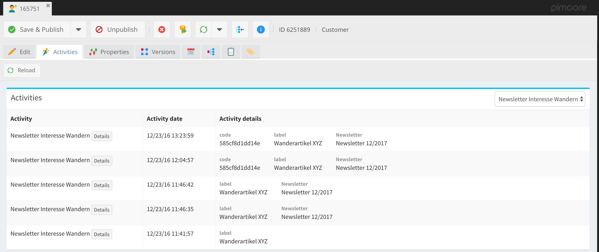

# Activities

An important part of the customer management framework are customer activities. They could be very simple (for example customer logged in) or quite complex (orders, bookings...). The CMF could be used to store all these customer related activty data and use it for example for segment building or as information for the customer service team.

Activities in the CMF are stored all together in a json store - by default in a MariaDB table (plugin_cmf_activities). 

## Using Pimcore objects and other data entities as activities

It's possible to use Pimcore objects (or other data entities/sources) as activities too. They just need to implement the ActivityInterface (for Pimcore objects extend the AbstractActivity class).

But allthough these activities have it's own data persistance they are additionally stored in the generic ActivityStore. The idea is that the ActivityStore saves all activities in a standardized form and represents a history of all customer activities. So if an activity is for example an order and later on someone cancels this order the order could be an own activity within the ActivityStore. So there could be the original order activity and an "cancellation" activity too. But for sure it depends on the use case if you need such a detailed history. It's possible to delete/update the original activity too in the ActivityStore.

## ActivityStore

The ActivityStore is responsible for saving and reading activity data from/into the database. By default a MariaDb implementation is used. The attributes of the activities just need to be a valid JSON object. There is no limitation in the number of attributes and nesting of attributes. The MariaDB implementation stores the table as dynamic columns. This makes it possible to use SQL queries for the attribute fields allthough they are alltogether stored in a blob field.

[docs for dynamic columns](https://mariadb.com/kb/en/mariadb/dynamic-columns/)

By implementing the ActivityStoreInterface it's possible to create your own implementation for storing activities (for example in a MongoDB database).

## ActivityManager

On top of the ActivityStore the ActivityManager is responsible for handling activities in the CMF. It's a relatively lightweight component which just handles the process of tracking activities. Most of the work is done within the ActivityStore - the ActivityManager is just responsible for putting everything together independetly of the concrete implementation of the ActivityStore.

### Tracking an activity

Example:
```
// $activity needs to implement ActivityInterface
\Pimcore::getContainer()->get('cmf.activity_manager')->trackActivity($activity);
```

## ActivityView

The CMF plugin contains a list view for displaying activities. This is added as a tab within the customer objects.




### Handle how activities are displayed in the ActivityView

It's possible to handle how activities are displayed within the ActivityView by implementing the following 3 methods of the ActivityInterface:
```php
/**
 * Returns an associative array with data which should be shown additional to the type and activity date within the ActivityView overview list.
 * 
 * @param ActivityStoreEntryInterface $entry
 *
 * @return array
 */
public static function cmfGetOverviewData(ActivityStoreEntryInterface $entry);


/**
 * Returns an associative array with data which should be shown ActivityView detail page.
 * 
 * @param ActivityStoreEntryInterface $entry
 *
 * @return array
 */
public static function cmfGetDetailviewData(ActivityStoreEntryInterface $entry);


/**
 * Optional: Returns a template file which should be used for the ActivityView detail page. With this it's possible to implement completely individual detail pages for each activity type.
 * 
 * @param ActivityStoreEntryInterface $entry
 *
 * @return string|bool
 */
public static function cmfGetDetailviewTemplate(ActivityStoreEntryInterface $entry);
```


### Generic activities

As mentioned above activities could use their own persistance additionally to the ActivityStore but don't have to. It's also possible to save activities only in the ActivityStore. The framework includes a generic activity implentation which could be used for these cases: 

```
CustomerManagementFrameworkBundle\Model\Activity\GenericActivity
```

This activity is used as a standard via the [REST api](./Webservice.md) if no implentationClass is defined. It can handle a nested, associative array of data which is only saved in the ActivityStore. 

But this doesn't mean that only these GenericActivity implementation could be used for activities without it's own persistance. It would definitly make sense to implement a separate activity class to track logins for example.